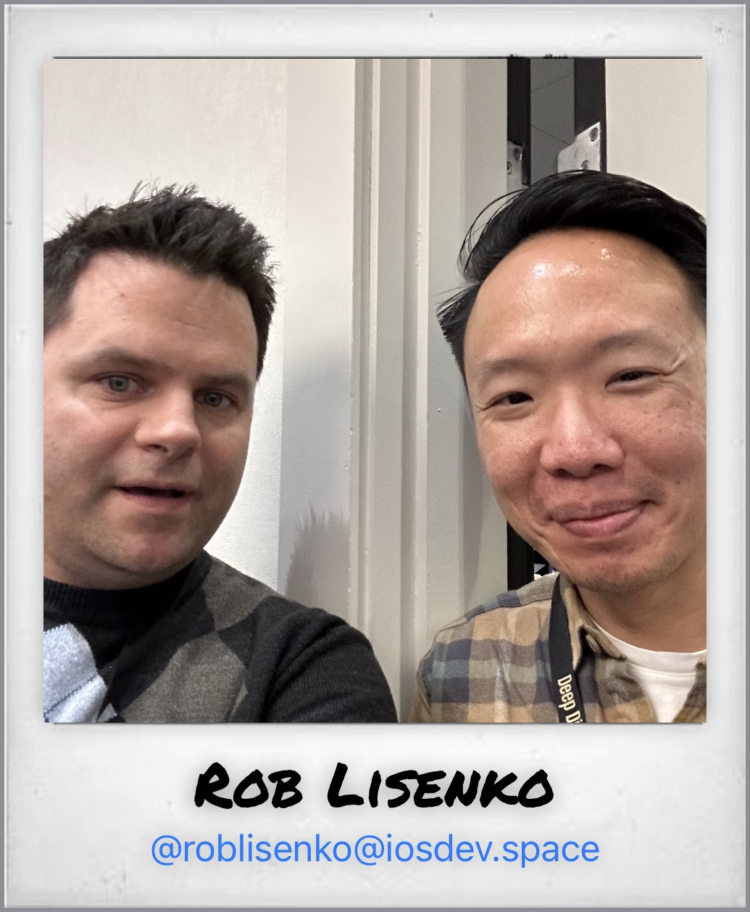

# IceBreakers

## Capture Toots from new friends at a Conference… Mastodon Toots — not any other kind of toots. 

When talking to people at a conference, it can be hard to remember names, let alone social handles. IceBreakers gives a way to do both while being a **non-alcoholic** social lubricant by making a game of how many new people you can meet! Watch your conference score climb with each new vintage-look capture and who knows, maybe your conference will even offer cheap prizes in exchange for a high IceBreakers score? (Anyone remember those pizza certificates for reading lots of books? Huh, why does pizza spring to mind?)

Take a selfie with someone and either capture their info, or just quickly AirDrop your pre-saved contact info to them. Either way counts towards your conference’s score!
